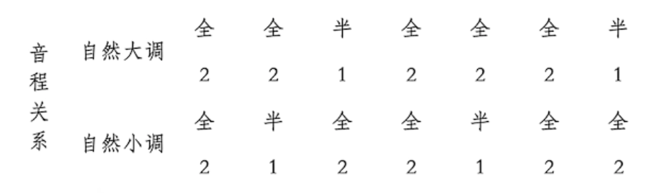
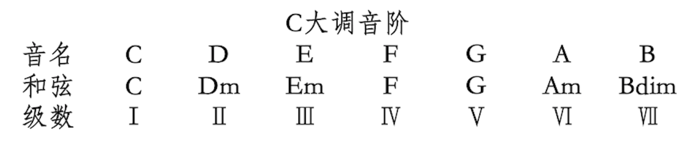
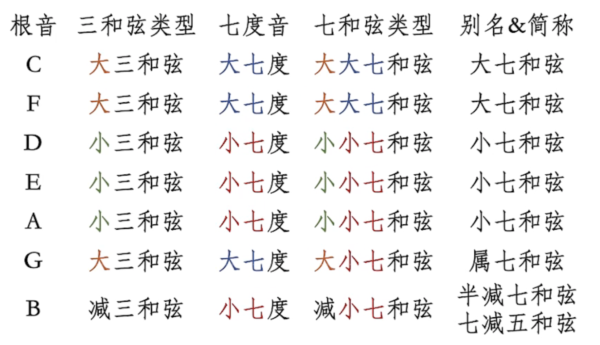
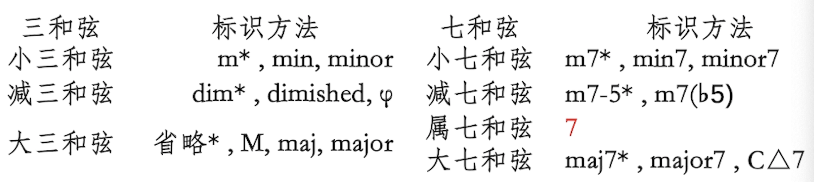
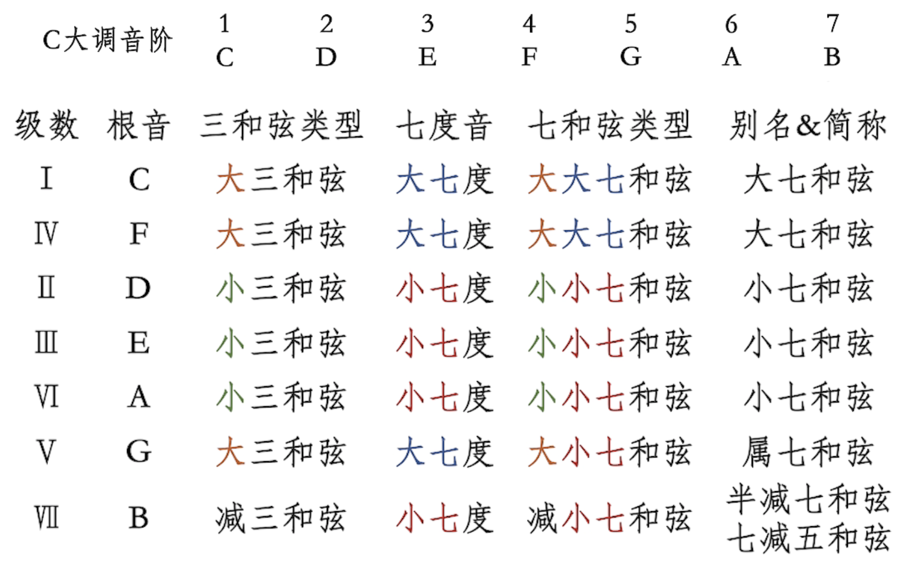
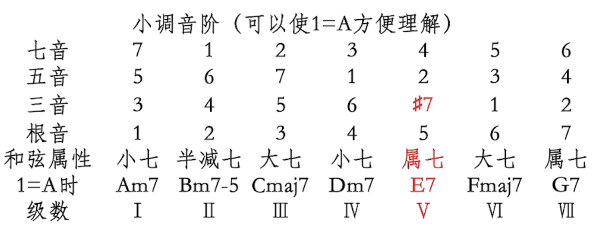

[指路入门教程地址](https://www.bilibili.com/video/BV1ot4y1S7jh)

乐理差不多全还给老师了，想重新系统学习一遍。

音程关系：
C（全）D（全）E（半）F（全）G（全）A（全）B（半） C
 

## 1.大三和弦
开心组 4+3 
第二个音是根音的大三度（间隔两个全音，e.g. do 和 mi）

## 2.小三和弦
伤心组 3+4 
第二个音是根音的小三度（间隔一个全音+一个半音，e.g. re 和 fa）

## 3.和弦命名
1）根音 和弦类型
2）起点 音程关系

例： #Fm  
#F为根音 升fa为根音；m代表第二个音是根音的小三度la；第三个音则为根音的纯五度（三个全音+一个半音）升do，即第三个音为第二个音的大三度。

也就是 升fa，la，升do

## 4.调式音阶

调式：一群在乐理上亲近的、好听的音
1）主音 音阶主角、从哪开始
2）音程关系 调式音阶的性质

（这个方便记忆，可以记C大调和A小调，都是白键）

关系大小调：指调号相同、音列关系相同、主音高度不同的两个调式（一个大调式、一个小调式子）。【这里没太看懂

把一个调式音阶内所有的音作为根音，搭配其他的调内音各做一个三和弦，排列组合出的七个和弦是相互兼容的。
旋律也使用相同的调式音阶来写。

和弦级数表示法：

例：A大调的五级和弦
1）A大调的构成音：A（全）B（全）C#（半）D（全）E（全）F#（全）G#（半）A
2）五级和弦对应的根音：E
3）使用E推大三和弦：E、G#、B（在A大调的调式音阶内），若使用E推小三和弦E、G、B（G不在A大调的调式音阶内）
4）所以这里是E大三和弦，即E和弦。

p.s.一个规律：大调中，一四五级用大三和弦，二三六级用小三和弦

## 5.复杂和弦
七和弦：在三和弦的基础上末尾用原来的方法加上一个音。根音与最高音成七度关系。
大七度：从根音到冠音中查看两音之间有几个半音，有一个半音的就是大七度。
小七度：从根音到冠音中查看两音之间有几个半音，有两个半音的就是小七度。

【这一段说实话没太看懂

大调音阶七和弦规律：

小调音阶七和弦规律：

## 5.和弦功能
1.I级和弦有让音乐开启或终止的功能。/IV(4)级和弦有让音乐开启的功能。
2.V级属七和弦有强烈的使音乐回到I级和弦的倾向。

五级 - 一级 = 四级 （都有过渡倾向）

流行区常见构成：I/IV+（中间部分）+V7(先5后1)

和弦进行：
1）递归流：453621
2）顺路流：15364125（卡农进行）【这个没听懂
3）6451：欧美王道
4）6451：小室进行
5）1645：doo-wop进行
 
七和弦的部分还是有点不太明白，过两天打算再看一遍，这个教程真的好牛。。。对小白醍醐灌顶的感觉。